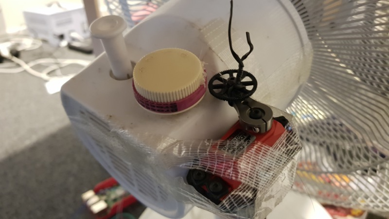

# Bike Fan Speed Control

This is an Android app which reads ANT+ bike speed sensor in the background, and sets fan speed automatically based on current wheel speed.

I use this when riding indoor on a bike trainer with my ANT+ enabled Samsung phone.

# Setup

I used a RPi4 connecting to a RC servo, which then controls the rotary knob on a cheap fan in front of my bike. This Android app then reads current wheel speed through ANT+ from the sensor on my bike, and sets desired servo position to turn off, turn to low, and turn to high fan speed.

I wish I had a programmable fan which can better simulates the headwind when cycling indoor.

In addition to this app, I also run Zwift Android app on the same phone, reading the same bike speed sensor from my bike. 

# Android app

I have to create a [Foreground Service](https://developer.android.com/guide/components/services.html#Foreground) because Zwift app (not the Companion) obviously puts a lot of stress on my 3-year-old S8 and the runtime keeps on killing my Service. 

 

# RC Servo

I use an analog RC servo retired from my 1/8 electric buggy, so it is quite strong without taking too much current from the 5v pins on my RPi4. 

I should've found a better way to turn the knob with the servo arm but this is what I've got so far over the weekend.

See my [go-servotester](https://github.com/starryalley/go-servotester/) project for more detail about RC servo control.

# Bike trainer and speed sensor

I have a 13+ years old Cycleops Fluid2 so I have to attach a speed sensor on it for Zwift. Sadly I don't have power meter either. The ANT+ speed sensor is an old Garmin one. Without a USB ANT+ stick, this leaves me with the only choice to use my ANT+ enabled Samasung phone to control the fan.

# Raspberry Pi

For ease of use (and personal use only) I created [a HTTP server](https://github.com/starryalley/go-servotester/tree/master/cmd/pi-servo-httpd) so I can simply send a HTTP GET to the endpoint, specifying the correct pin (I use pin 11) to control the RC servo.

Example control command:

Set servo position to 85% (endpoint 1.0ms to 2.0ms PWM, the usual range of a RC servo)
`curl http://192.168.1.111:8080/servo?pin=11&pos=85`
